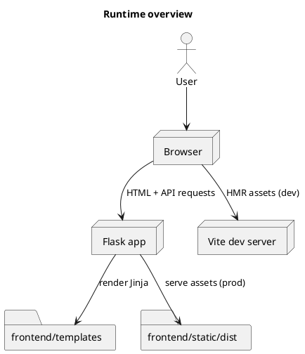
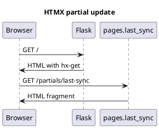
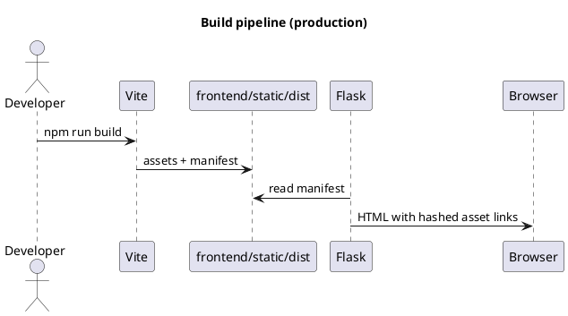

# Flask MD3 UI

This project uses Flask for the backend and Vite (TypeScript + Tailwind + Material Web + HTMX)
for the frontend. The UI is served from the Flask app with Vite dev mode in development
and hashed assets in production.

## Prerequisites

- Python 3.10+ (recommended)
- Node.js 18+ with npm

## Setup

```bash
python -m venv .venv
source .venv/bin/activate
pip install -r requirements.txt

npm install
```

## Run (development)

Terminal 1:
```bash
npm run dev
```

Terminal 2:
```bash
VITE_DEV=1 python app.py
```

Open `http://localhost:5000`.

## Run (production build)

```bash
npm run build
python app.py
```

## Environment variables

- `VITE_DEV=1` enables the Vite dev server and HMR.
- `VITE_DEV_SERVER` overrides the dev server URL (default: `http://localhost:5173`).

## Project layout

```
backend/              # Flask app, routes, services
frontend/src/         # Vite entrypoints (TS, Tailwind, MD3 theme)
frontend/templates/   # Jinja templates (layout + pages + partials)
frontend/static/dist/ # Vite build output (manifest + assets)
```

## Architecture and decisions

### Technology stack and rationale

- Flask: simple server-rendered HTML with clean route separation, ideal for HTMX.
- Material Web (MD3): accessible, consistent components with theming via CSS variables.
- Tailwind: utility-first layout and spacing without fighting component internals.
- HTMX: progressive enhancement for partial updates without SPA complexity.
- TypeScript: safer DOM usage and API response handling as the app grows.
- Vite: fast dev server + HMR, production builds with hashed assets and manifest.

### Recommended usage patterns (best practice)

HTMX approach:
- Use HTMX for partial updates and forms (tables, filters, status widgets), not full-app navigation.
- Serve fragments via dedicated routes and partial templates, then progressively enhance full pages.
- Use `hx-get` and `hx-post` for UX improvements; only use `hx-boost` if you explicitly want
  SPA-style navigation.

MD3 + Tailwind approach:
- Use MD3 Web Components for controls (buttons, fields, chips, tabs) and Tailwind for layout,
  spacing, grid, and typography.
- Avoid styling internal MD3 parts directly; theme via CSS variables.
- Mirror MD3 tokens into Tailwind's theme (colors, radii) so both systems stay consistent.
- Use `data-theme="dark"` with Tailwind `darkMode: ["attribute", "data-theme"]` so it follows
  the existing toggle.

Build output approach:
- With Vite, output to `frontend/static/dist` and enable `manifest.json` for hashed assets.
- In Flask, load assets via the manifest in production; in dev, use the Vite dev server and HMR.
- This keeps Flask's static serving simple and makes cache busting reliable.

### How assets are loaded

- Dev mode (`VITE_DEV=1`): templates inject Vite dev server scripts for HMR.
- Prod mode: Flask reads `frontend/static/dist/.vite/manifest.json` and injects hashed CSS/JS.

### Why this is not a SPA

Server-rendered HTML keeps the backend as the source of truth and makes HTMX updates trivial.
The UI still feels modern thanks to MD3 components and small, targeted dynamic updates.

### PlantUML diagrams

Runtime overview:


HTMX partial update flow:


Build and deploy flow:

